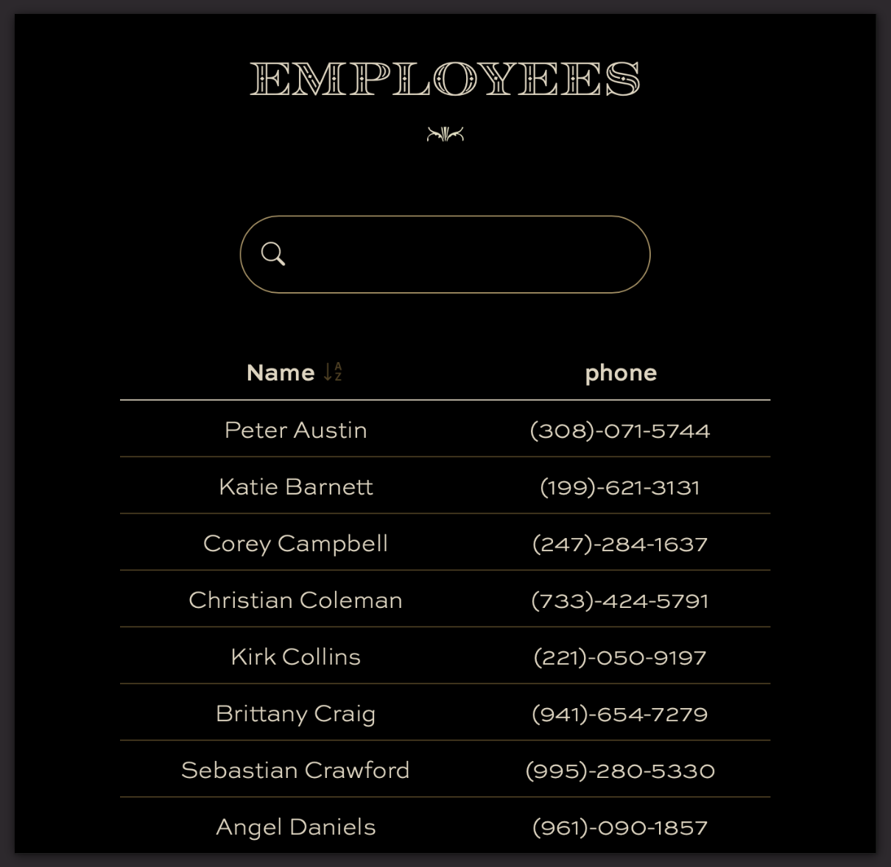

# Employee Directory

<a href="https://opensource.org/licenses"></a>

## Table of Contents
* [Description](#description)
* [Installation Instructions](#installation-instructions)
* [Usage Information](#usage-information)
* [Contribution Guidelines](#contribution-guidelines)
* [License Information](#license-information)
* [Questions](#questions)

## Description
A directory list of employees built using React.js

## Installation Instructions
After downloading, run ```npm install``` and run locally.

## Usage Information
Use the 'Name' and 'phone' tabs to sort data in the table, or type in the search field to filter the list by name or phone number.

You can view the live project [here.](https://n8blake.github.io/employee-directory/)




## Contribution Guidelines
If you wish to contribute, open an issue on GitHub

## License Information

<a href="https://opensource.org/licenses"></a>


		

## Questions
Email [hello@n8blake.com](mailto:hello@n8blake.com)
or create an issue on [Github](https://github.com/n8blake)  
